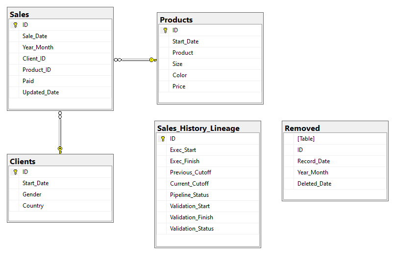

# Table of Contents 
1. [Introduction](README.md#Introduction)
2. [Requirements](README.md#Requirements)
3. [Data Generation](README.md#Data%20Generation)
4. [Process Overview](README.md#Process%20Overview)
5. [Trial Instructions](README.md#Trial%20Instructions)

# Introduction
**Big Data pipeline using Python, Pyspark, SQL Server, Hive, Apache Hadoop with data lineage**

This is a project created with the goal of serving as a milestone that finalizes a period of self-study with the purpose of becoming a Data Engineer.  Having past experience as a Data Analyst, I decided to use a few technologies with which I have worked before professionally such as SQL Server and Power BI.

This project consists of a process that encompasses two Big Data pipelines that ultimately work as one single Big Data batch process. 
For this project, I have created a dummy transactional database hosted on SQL Server for a fictional company called CoolWearPT, the company sells and exports clothes within the European Union.
The goal here is to pull gigabytes or terabytes of data from a production database and send it on a pipeline to Hive using Python, and then from Hive to apply calculations to the immense amount of data and obtain aggregated datasets that are then sent back to SQL Server but now hosted on a data mart for visualization through Power BI. As we do not want to transfer data unnecessarily this process was created using a data lineage approach that allows to keep track of what data needs to be transferred, thus avoiding a full load of the data to the data lake table.

# Requirements

**Languages:** 
* Python 3.8
* T-SQL

**Data Frameworks and RDBMS:**
* SQL Server
* Apache Hadoop 3
* Hive 3
* PySpark 3

**Orchestration tools:**
* Airflow

**Visualization tools:**
* Power BI

# Data Generation

In order to run the process we first need our raw material, data, this falls outside the scope of the pipeline process of this project and therefore I'm giving it its own dedicated section here, I will also take this opportunity to give an overview of the transactional database to which I gave the name of Production. I have created this database for this project as well as a script file that randomly generates data with the help of Numpy. I have placed this data generating Python script on the folder "data_generation". The script parses the credentials information for SQL Server from a config file that I've placed on the folder "config". This is a good way of avoiding having passwords or other sensitive information popping up as part of the running script. I've designed the database in a fairly simple way with few tables and already having in mind that this project is only for exemplifying how to do one pipeline and not all pipelines that an actual business would require. The schema of the database is as shown below:

The main table for our pipeline query will be the Sales table which has foreign keys referenced by the Clients and Products tables. The data generation script randomly removes and updates sales records, it also inserts new clients, and new sales for both new or existing clients. The tables Removed and Sales\_History\_Lineage are meant for the pipeline process. The script stamps the Sales table on the Update_Date field whenever it updates a record. It also creates a record on the Removed table whenever a sale record is deleted. With these timestamps we have all the information we need to track the history of changes. A real oltp database would ideally have this sort of mechanism associated to all the tables that need to be tracked, either implementing the record creation through triggers or as part of the company's application transactions. The Sales\_History\_Lineage is only used once the pipeline is initiated, it could have been placed elsewhere.

# Process Overview

Our Big Data pipeline is the combination of two smaller pipelines as shown on the diagram below:

The first pipeline extracts sales data along with client and product information and loads it into Hive in Hadoop using Pandas and Pyspark. We are not using the usual Data Warehouse Fact/Dimension paradigm here, the data is dumped in bulk into a single table in Hadoop using Hive as a data lake. This is the ideal solution for our goal, as we want to avoid the use of multiple joins and creation of a lot of small files, as that doesn't work well in Big Data. The data lineage for our pipeline is kept on Sales\_History\_Lineage and is managed through the use of cut-off times through which we verify which records were inserted, updated or deleted. The approach to update the Hive table is to partition it and drop the partitions where data has changed and re-create it with a new load, to achieve this I created a field composed of year and month (year_month, i.e. 202108), this partition gives us a good degree of granularity to handle changes, usually in a real-life situation records that were created long ago are unlikely to change, but if they do change we only need to replace the data for the partition with corresponding year and month. At the end of this first pipeline there's a validation step that does a few calculations on both SQL Server and Hive and allows to confirm that the pipeline worked correctly. I've dedicated a script just for the SQL connection object and another for the Spark session object. This is because if we were to have multiple pipelines for this data lake then it would not be desirable for each individual pipeline to have its own version of these connections, creating them at a centralized point allows for an easier long term management of the connection configurations which is expected to follow the same logic for all pipelines.

The second pipeline queries the data from the sales_history table we created on the first pipeline and transforms it by aggregating by country and other relevant fields accordingly. These aggregations are needed for the visuals of our Power BI dashboard, the calculations result in two datasets. These results are loaded by the pipeline to staging tables on a data mart on SQL Server, a subsequent transaction is performed that truncates and loads the final tables as a single operation.

Both of these tasks are handled by Airflow on a single dag file which is called sales\_pipeline\_dag.py which can be found on the "dags" folder. The dag calls the two pipeline python scripts through a bash operator. Airflow is perfect for our case as it allows to schedule the scripts accordingly ensuring that the second tasks follows after the completion of the first one as well as prevents multiple concurrent runs of the pipeline at the same time which could mess up the lineage records.

